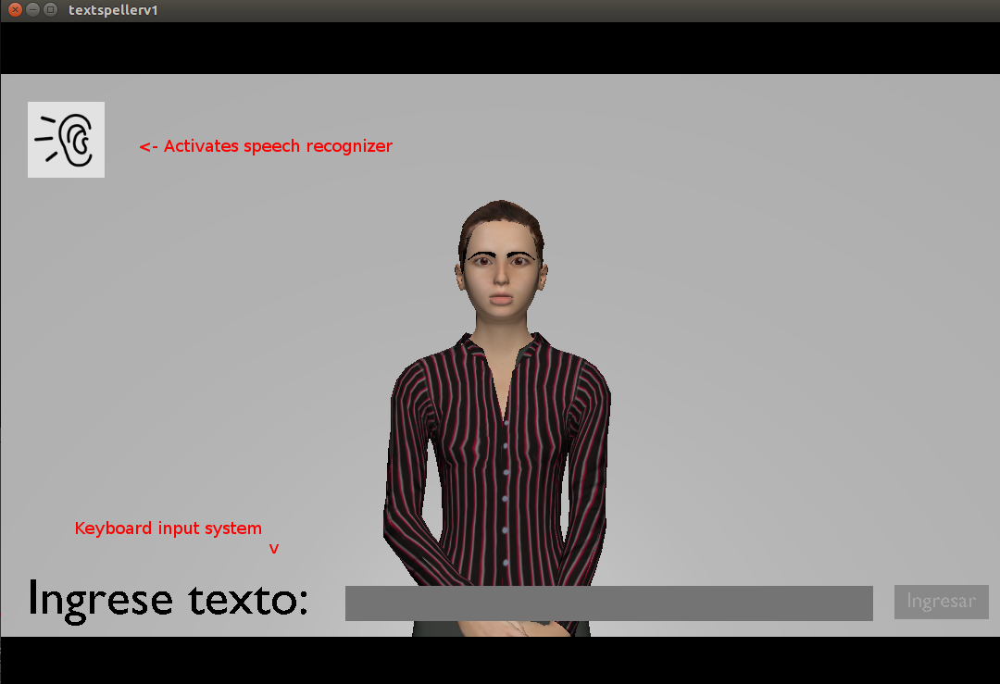

# chilean_sign_language_speller

Written or spoken Spanish to Chilean Sign Language translator. Uses a Blender platform and Avatar made in MakeHuman to perform each Sign. Currently it can only play alphabet signs.
This repository includes a .blend file, supporting codes to adjust the posture of the avatar in the Blender platform and a .zip file that includes the Windows .exe file.
## Getting started

### Prerequisites 

  * python==3.5
  * blender=>2.79
  * speech_recognition==2.8.1
  * pyaudio==0.2.8
  
## How to use
## Executing in the Blender platform

Open the .blend file in Blender. There, at the right side of the screen, on the Properties<Scene space, click on the "Play" button in the Standalone Player area:

A window showing the avatar and two input systems will pop up:

### To use the Keyboard input system

Just write down using your keyboard and each letter will show automatically. Press "Enter" to start playing each sign.

The system will indicate on the message above the word "Reproduciendo" while the input word is playing and it will change to "Listo!" once the word is finished.

### To use the Speech input system

Make sure to have a working mic input and internet connection in your system. Click the ear icon on the top left corner and input your spoken message into the system of 5 seconds max. This system recognizes Spanish, to change the input language,

### Executing from the executable file

Using the speller.exe executable file in the .zip document. 
**NOTE:** The executable file has issues detecting the SpeechRecognition library, so it can only play via keyboard inputs.

## Authors

* Yetzabeth González - *Instituto de Acústica UACh*
* Victor Vargas Sandoval victorvargassandoval93@gmail.com - *Instituto de Informática UACh*
* Victor Poblete - *Instituto de Acústica UACh*
* Pablo Huijse - *Instituto de Informática UACh*

## License

This project is licensed under the MIT License.

## Acknowledgments

We would like to thank all those who have made this project possible, especially UACh Inclusiva for giving us their full support and showing us the reality of deaf people in Chile.
